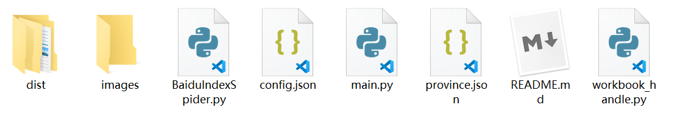
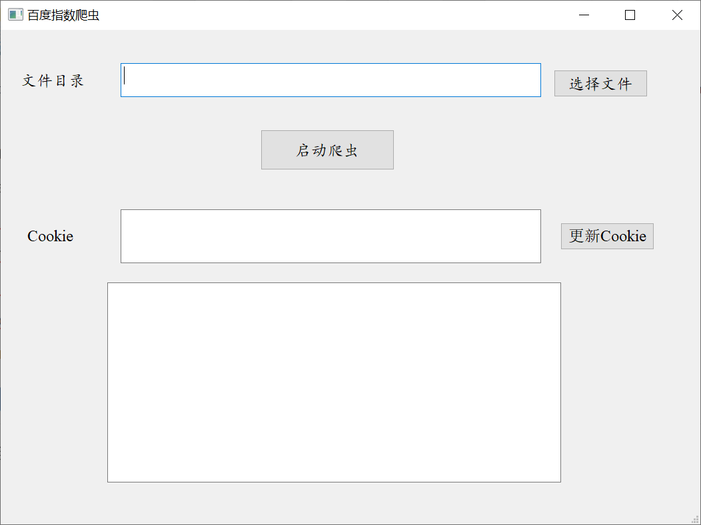
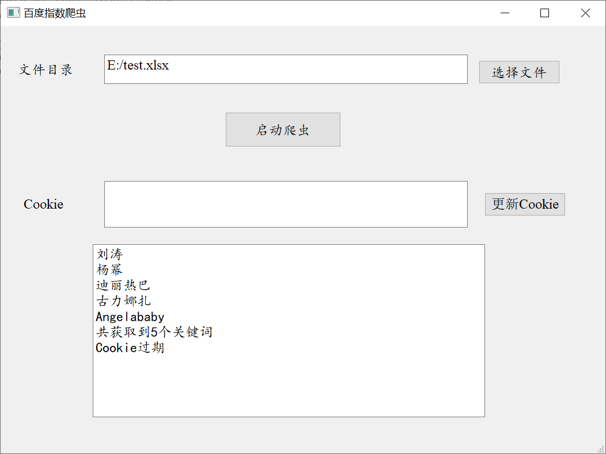
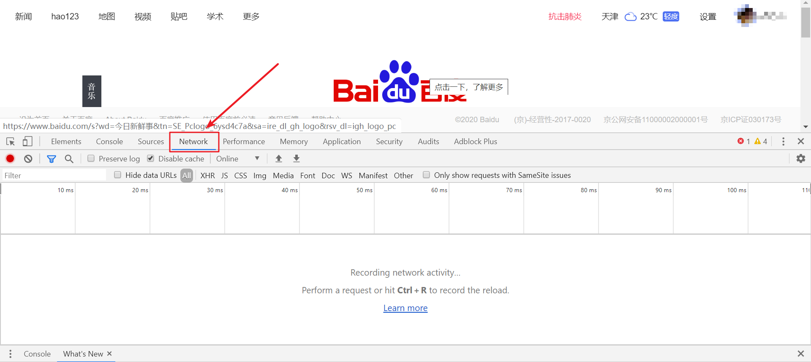
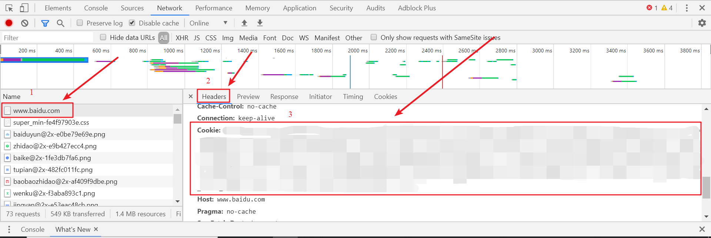
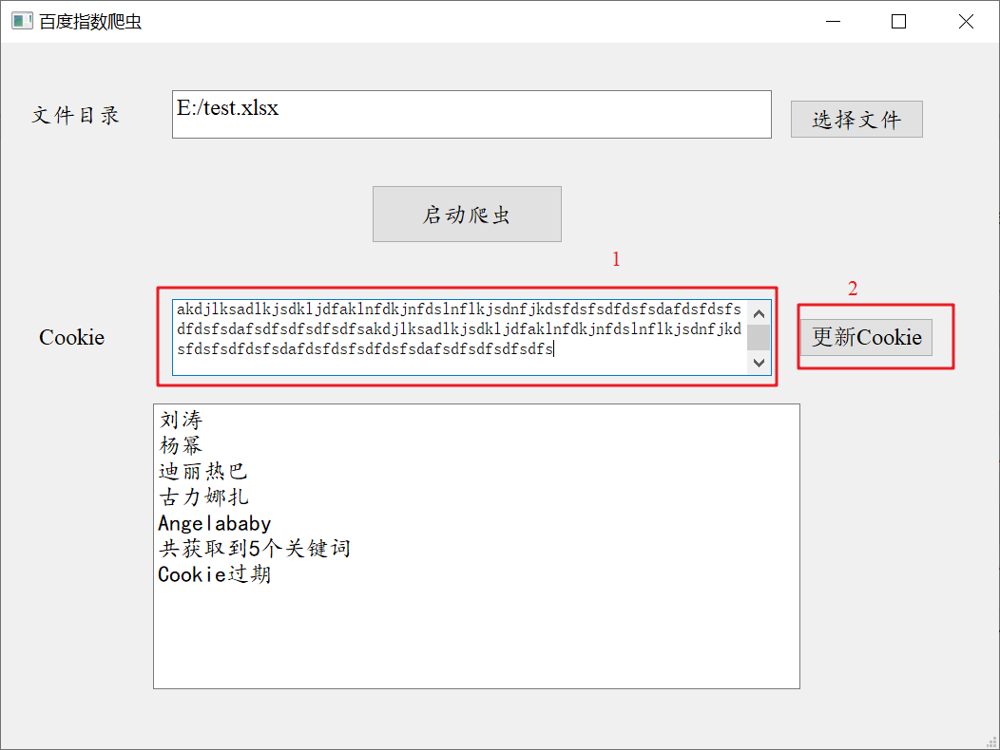

# 百度指数爬虫

## 文件结构

- dist文件夹为最后生成的软件，在这个目录下的main文件夹中的main.exe为最后的可执行文件
- images为本文件中截图的存放目录
- BaiduIndexSpider为项目的爬虫模块
- config.json用于存放项目的配置信息
- main.py为项目的界面模块，也包含了对另外两个模块的调用
- province.json为身份配置文件
- workbook_handle.py为最后的Excel处理模块

## 使用方法

在当前目录下运行`python main.py`或者双击dist/main/main.exe可以开启程序，并看到如下界面：

- 首先点击选择文件，选择要爬取的keywords的excel，其中所有的keyword必须存放在第一列
- 之后点击启动爬虫
- 百度指数要求必须登录才可访问，如果如下图所示出现了Cookie过期的提示，按后续步骤填写Cookie

- Cookie的获取：

  - 1、在浏览器中打开百度首页，并登录
  - 2、登录后按F12，打开控制台，点击下图中的network，并且刷新页面

  

  - 刷新页面

  - 在Network中找到最上面的www.baidu.com，点击，在右边点击Headers，然后找到里面的Cookie字段。将冒号后面的内容复制

    

  - 将复制的内容粘贴在Cookie中，点击后面的更新Cookie按钮

    

  - 点击爬虫，开始爬虫
  - 最后会在之前选择的Excel的文件夹内新建一个output.xls